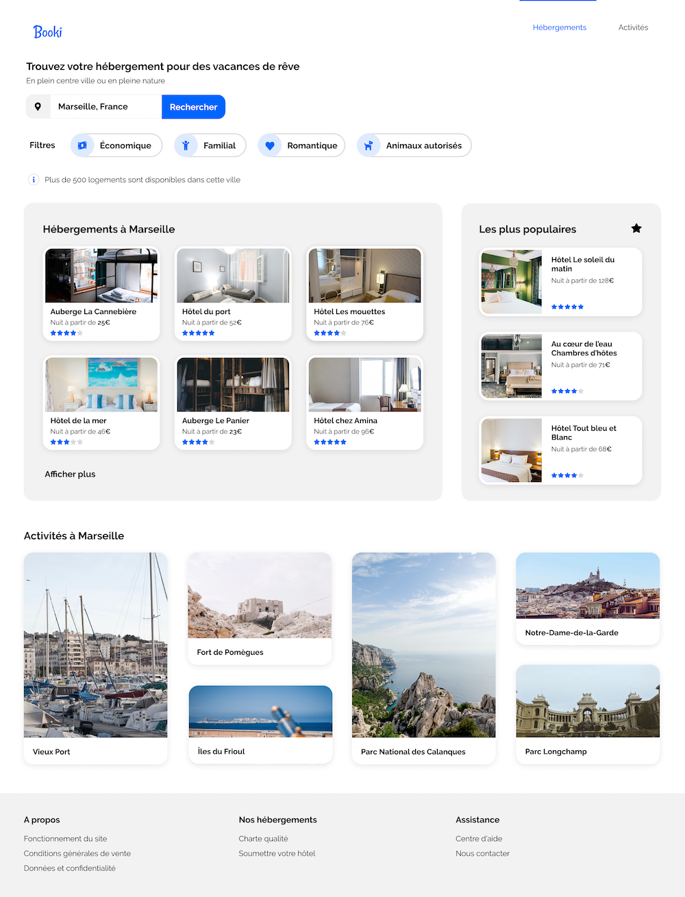

# 

### Visitez le projet réalisé <a href="https://greenbeetlestore.github.io/Booki.v2.0/">ici : https://greenbeetlestore.github.io/Booki.v2.0/</a>

# P2 Transformez une maquette en site web avec HTML &amp; CSS . 

# Étapes clés – Projet 2 du parcours Développeur web

## Transformez une maquette en site web

## Étape 1 : Mettez en place votre environnement de développement
5 % d’avancement

Démarrez votre projet dans de bonnes conditions en installant un environnement de développement solide et rigoureux, ainsi que les fichiers nécessaires à votre développement.

### 🎯 Une fois cette étape réalisée, vous aurez :

● un fichier index.html ;

● un dossier “css” avec votre ou vos fichiers CSS ;

● un dossier “assets” ou “images” contenant les images du projet.

### 📌 Recommandations :

● Commencez par installer VSCode.

● Ajoutez la propriété CSS box-sizing.

● Ajoutez les meta charset et viewport.

● Ajoutez un fichier normalize.css.

● Importez les polices depuis Google Font.

● Ajoutez l’intégration de FontAwesome.

### ⚠️ Points de vigilance :

● Attention à bien importer vos fichiers CSS dans le “bon” ordre, autrement dit, du plus générique au plus spécifique.

● Attention à bien appeler votre fichier CSS dans votre HTML, sans quoi vous ne pourrez pas utiliser le style CSS.

### 📃 Ressources :

● Le cours <a href="https://openclassrooms.com/fr/courses/6943241-mettez-en-place-votre-environnement-front-end/6943248-installez-vos-outils-de-developpement-front-end">Installez VSCode et vos outils de développement</a>.

● L’article <a href="https://la-cascade.io/box-sizing-pour-les-nuls/">Apprenez à mettre en place la propriété box-sizing</a>.

● L’article <a href="https://www.hideout-lastation.com/using-normalize-css">Utilisez normalize.css dans vos projets pour assurer la cohérence entre les navigateurs</a>.

● L’article <a href="https://www.pierre-giraud.com/html-css-apprendre-coder-cours/meta-viewport/">Utilisez la balise meta viewport pour améliorer l’expérience mobile</a>.

## Étape 2 : Découpez votre maquette à l’aide d’un papier et d’un crayon
10 % d’avancement

Avant de commencer à coder, structurez votre projet en dessinant les grandes sections de la maquette de Booki pour faciliter votre intégration.

### 🎯 Une fois cette étape réalisée, vous aurez :

● la structure de votre code HTML ; vous pourrez vous référer à cette structure au moment de l’intégration.

### 📌 Recommandations :

Posez-vous les questions suivantes :

● Où se trouve le header ? Comporte-t-il aussi un menu de navigation ?

● Où se trouve le footer ? Que comprend-il comme éléments HTML (des liens, des listes, etc.) ?

● À quoi la partie “Hébergements à Marseille” ou “Les plus populaires” correspond-elle au niveau HTML ? Quels vont être les éléments HTML composant la partie “Hébergements à Marseille” ?

Une fois que vous avez réalisé le schéma HTML de votre maquette, discutez-en avec d’autres étudiants et avec votre mentor. Cette étape va vous permettre de vous poser les bonnes questions, et de vérifier que vous n’avez rien oublié.

### ⚠️ Points de vigilance :

● Attention à ne pas réaliser un schéma trop “propre”. Ce schéma doit avant tout être simple, lisible et complet, pas besoin de le rendre très “joli”.

### 📃 Ressources :

● Le chapitre <a href="https://openclassrooms.com/fr/courses/3504431-decoupez-et-integrez-une-maquette/3605766-traduire-les-elements-visuels-en-html#/id/r-3672510">Bien comprendre la maquette de ce cours</a>.

● Le webinaire <a href="https://app.livestorm.co/openclassrooms-1/decouper-une-maquette-pour-preparer-lintegration?type=detailed">Découpez une maquette pour préparer l’intégration</a>.

## Étape 3 : Intégrez le header du projet
20 % d’avancement

C’est l’heure de commencer à coder le projet. Dans cette étape, vous allez vous attaquer à l'en-tête du projet.

### 🎯 Une fois cette étape réalisée, vous aurez :

● le code HTML de l’en-tête de la page.

### 📌 Recommandations :

● Intégrez d’abord la version desktop avant de réaliser les versions tablette puis mobile.

● Réalisez d’abord le header pour la version desktop du projet. Une fois la version desktop finalisée, attaquez-vous à la version tablette puis à la version mobile.

● Vous pouvez utiliser Flexbox pour réaliser le positionnement entre le logo Booki et les parties Hébergements / Activités.

### ⚠️ Points de vigilance :

● Attention à ne pas oublier la bordure bleue qui s’affiche au survol.

● Attention, la bordure bleue s’affiche au-dessus en version desktop et en dessous en version mobile.

### 📃 Ressources :

● Le webinaire <a href="https://s3-eu-west-1.amazonaws.com/course.oc-static.com/projects/Webinars/Code/DW_P2_int%C3%A9grer_maquette_Feb_2021/Webinaire_DW_P2_inte%CC%81grer_maquette+enonce.pdf">Intégrez une maquette</a> (<a href="https://app.livestorm.co/openclassrooms-1/integrez-une-maquette?type=detailed">replay ici</a> et <a href="https://s3-eu-west-1.amazonaws.com/course.oc-static.com/projects/Challenge_DW_P2/Correction_code_html.zip">corrigé ici</a>).

● La vidéo <a href="https://www.youtube.com/watch?v=_SEwzS1vG28">Intégrer une maquette</a> de Grafikart.

● Le chapitre <a href="https://openclassrooms.com/fr/courses/1603881-apprenez-a-creer-votre-site-web-avec-html5-et-css3/1607616-utilisez-le-responsive-design-avec-les-media-queries">Utilisez le responsive design avec les Media Queries</a> de ce cours.

● <a href="https://css-tricks.com/snippets/css/a-guide-to-flexbox/">Découvrez un guide complet pour Flexbox</a> : ce guide, à enregistrer dans vos favoris, vous permettra de connaître précisément les propriétés relatives à Flexbox.

● L’article <a href="https://la-cascade.io/flexbox-guide-complet/">Découvrez des bonnes pratiques pour Flexbox</a>.

## Étape 4 : Ajoutez le formulaire de recherche
30 % d’avancement

Vous pouvez maintenant passer à l’intégration de la barre de recherche de la page grâce à un formulaire. Il est possible que cette étape soit un peu plus longue que les autres.

### 🎯 Une fois cette étape réalisée, vous aurez :

● un formulaire de recherche entièrement intégré, tant pour les ordinateurs que pour les tablettes et les mobiles.

### 📌 Recommandations :

Pour cette étape, vous allez devoir jouer avec les positionnements “absolu” et “relatif”.

● Commencez par réaliser la version desktop. Essayez d’englober les trois éléments au sein d’une même balise HTML.

● Intégrez d’abord le contenu HTML avant la partie CSS.

● Une fois que vous êtes satisfait de votre version desktop, réalisez la version tablette puis la version mobile.

● Pensez à utiliser des “display: none” pour afficher ou masquer du contenu HTML.

### ⚠️ Points de vigilance :

● Attention au style de la barre de recherche : sur desktop, le bouton de recherche comprend le texte “Rechercher” alors que sur mobile, c’est une loupe.

● Attention, certains des borders radius changent en fonction de la version, mobile ou desktop.

### 📃 Ressources :

● Le chapitre <a href="https://openclassrooms.com/fr/courses/1603881-apprenez-a-creer-votre-site-web-avec-html5-et-css3/1607171-creez-des-formulaires"Créez des formulaires</a> de ce cours.

● L’article <a href="https://openweb.eu.org/articles/initiation_absolue">Initiation au positionnement CSS : 3. position absolue et fixe</a>.

● <a href="https://developer.mozilla.org/fr/docs/Web/CSS/position">Découvrez les différentes propriétés de positionnement CSS</a> : à mettre dans vos favoris ; vous retrouvez dans cette ressource des conseils et de la documentation pour les différentes propriétés de positionnement.

## Étape 5 : Ajout de la partie Filtres
35 % d’avancement

Vous pouvez maintenant commencer l’intégration des éléments de filtre de la page.

### 🎯 Une fois cette étape réalisée, vous aurez :

● la partie filtre de votre projet entièrement réalisée.

### 📌 Recommandations :

Pour réaliser les filtres, vous n’avez pas besoin d’utiliser les positionnements “absolu” et “relatif” : vous pouvez utiliser uniquement Flexbox. Bonne nouvelle : il n’y a aucune différence de design entre la version desktop et la version mobile.

● Utilisez Flexbox aussi bien pour englober l’ensemble des filtres, qu’à l’intérieur de chacun des filtres.

● Vous pouvez utiliser flex-wrap pour gérer le positionnement des éléments.

### ⚠️ Points de vigilance :

● Faites bien attention à quel moment utiliser une propriété margin plutôt que padding.

● Regardez bien comment est conçu le design du filtre : la partie gauche de chacun des filtres (contenant l’icône et la couleur de fond) dépasse légèrement du cadre.

● Il est préférable d’utiliser des pixels plutôt que des pourcentages pour les valeurs des marges et des paddings.

### 📃 Ressources :

● L’article <a href="https://www.alsacreations.com/tuto/lire/1038-gerer-debordement-contenu-et-cesures-css.html">Gérer les débordements de contenus grâce à CSS</a>.

● La documentation de la <a href="https://developer.mozilla.org/fr/docs/Web/CSS/overflow">propriété overflow sur MDN</a>.

## Étape 6 : Réalisez la “card” présente dans “Hébergements à Marseille”
40 % d’avancement

Dans cette étape, vous allez devoir réaliser le design de la “card” “Auberge La Cannebière”. 
Dans l’étape d’après, vous vous occuperez de celle contenue dans la partie “Les plus populaires”, avant de vous attaquer enfin à la mise en page de l’ensemble de ces éléments.

Intégrer chacun de ces éléments de manière séparée va vous permettre d’isoler les difficultés.

### 🎯 Une fois cette étape réalisée, vous aurez :

● le premier élément du deuxième tiers de votre projet. Gardez-le de côté, vous en aurez besoin dans l’étape 8.

### 📌 Recommandations :

● Essayez d’abord de travailler sur l’image et sur le titre “Auberge La Cannebière". Une fois que vous serez satisfait du résultat, vous pourrez ajouter les informations sur la nuit, et les icônes de notation.

● La propriété CSS `object-fit` peut vous permettre d’ajuster la taille de l’image à son conteneur.

● Vous pouvez éventuellement donner une taille fixe pour les cards.

### ⚠️ Points de vigilance :

● N’oubliez pas l’effet CSS demandé. Vous pouvez l’ajouter au survol et changer, par exemple, la couleur de police.

● Si vous devez utiliser des margins et des paddings, privilégiez les pourcentages.

● Les images doivent être intégrées via le HTML. N’oubliez pas les attributs alt.

### 📃 Ressources :

● L’article <a href="https://www.gekkode.com/developpement/realiser-une-carte-en-css-card-ui-css/">Réaliser une carte en CSS (Card UI CSS)</a>.

● L’article <a href="https://www.w3schools.com/howto/howto_css_cards.asp">How to – Cards de W3C</a> avec quelques snippets de code pour réaliser une card.

## Étape 7 : Réalisez la “card” présente dans “Les plus populaires”
50 % d’avancement

Dans cette étape, vous allez réaliser la carte présente dans “Les plus populaires”. Bien que le design soit un peu différent de celui de la card contenue dans “Hébergements à Marseille”, vous allez utiliser les mêmes méthodes.

### 🎯 Une fois cette étape réalisée, vous aurez :

● les deux cards utilisées pour les parties “Hébergements à Marseille” et “Les plus populaires”. Il sera alors temps de combiner le tout !

### 📌 Recommandations :

● Répétez les conseils de l’étape 6.

### ⚠️ Points de vigilance :

● N’oubliez pas les border radius sur les images.

● Les images doivent être intégrées via le HTML. N’oubliez pas les attributs alt.

## Étape 8 : Gérez l’affichage des conteneurs “Hébergements à Marseille” et “Les plus populaires”
60 % d’avancement

Maintenant que vous avez les cards de ces deux sections, il est temps de les combiner pour réaliser la dernière. Dans cette étape, vous allez ajouter l’ensemble des cards restantes, et travailler sur la mise en page.

### 🎯 Une fois cette étape réalisée, vous aurez :

● une grande partie de votre site qui aura été mise en page. Il ne vous restera plus que la partie “Activités à Marseille” et le pied de page à réaliser.

### 📌 Recommandations :

● Utilisez flex et les pourcentages pour gérer les règles d’affichage. Les ratios sont d’un tiers et de deux tiers. À vous de transformer ça en pourcentages.

● Faites d’abord la mise en page entre les deux conteneurs avant de vous attaquer à l’intérieur à la mise en page dans chacun des conteneurs.

● Ajoutez d’abord chacune des cards dans chacun des conteneurs avant de réaliser la mise en page.

### ⚠️ Points de vigilance :

● L’ordre d’affichage des deux conteneurs change en fonction de la version : mobile ou desktop.

● Normalement, vous devriez avoir peu de modifications à apporter aux cards que vous avez intégrées dans les parties précédentes.

● N’oubliez pas le titre, l’icône et le lien “afficher plus”.

● Les couleurs de fond s'inversent entre la version mobile et la version desktop.

### 📃 Ressources :

● Le chapitre <a href="https://openclassrooms.com/fr/courses/1603881-apprenez-a-creer-votre-site-web-avec-html5-et-css3/3298561-faites-votre-mise-en-page-avec-flexbox">Faites votre mise en page avec Flexbox de ce cours</a>.

● L’article <a href="https://www.pierre-giraud.com/flexbox-css/">Flexbox CSS – Flexible Box Layout : Le Guide complet</a>, pour aller plus loin avec Flexbox.

## Étape 9 : Intégrez le conteneur “Activités à Marseille”
70 % d’avancement

Dans cette étape, vous allez devoir intégrer des conteneurs de différentes tailles. En réalisant cette étape d’abord sur desktop avant de vous lancer dans les versions tablette et mobile, vous allez pouvoir vous concentrer sur la principale difficulté de ce projet.

### 🎯 Une fois cette étape réalisée, vous aurez :

● quasiment terminé le projet. Il ne vous restera plus que le footer à réaliser. Un grand bravo pour votre travail !

### 📌 Recommandations :

● Avant d’intégrer les images, essayez de créer un conteneur par activité et donnez-lui une classe. Cette classe va vous permettre de jouer avec la taille, et notamment la hauteur de votre élément.

● Une fois que vous serez satisfait de la hauteur et de la disposition de chacun des conteneurs, vous pourrez ajouter les images et les textes.

### ⚠️ Points de vigilance :

● Les images doivent être intégrées via le HTML et non le CSS. N’oubliez pas les attributs alt.

### 📃 Ressources :

● Découvrez quelques exemples de mise en page CSS avec Flexbox dans <a href="https://www.quackit.com/css/flexbox/examples/">cet article</a>.

● L’article <a href="https://tobiasahlin.com/blog/common-flexbox-patterns/#masonry-or-mosaic">Common CSS Flexbox Layout Patterns with Example Code</a> pour aller plus loin avec Flexbox, et des patrons de mise en page.

## Étape 10 : Implémentez le footer
85 % d’avancement

Dans cette étape, vous allez devoir intégrer le footer avec ses nombreux liens. Cette partie ne présente pas de réelles difficultés. Comme pour les autres étapes, pensez à développer d’abord la version desktop avant de réaliser la version mobile.

### 🎯 Une fois cette étape réalisée, vous aurez :

● terminé le code du projet. Il vous faudra maintenant vérifier si votre code est conforme aux validateurs W3C.

### 📌 Recommandations :

● Une fois encore, vous pouvez utiliser Flexbox pour la mise en page.

### ⚠️ Points de vigilance :

● Si vous utilisez des `ul` pour réaliser les liens, vous avez par défaut un padding-left qui s’applique. Pensez à l’enlever.

● Faites bien attention à respecter le positionnement du footer et notamment le “À propos”, avec le reste de la maquette.

## Étape 11 : Vérifiez la qualité de votre code 100 % d’avancement

Félicitations, vous voici arrivé à la dernière étape du projet. Vous allez maintenant devoir vérifier si votre code est conforme aux validateurs W3C
(HTML et CSS).

### 🎯 Une fois cette étape réalisée, vous aurez :

● terminé le projet !

● Il ne vous restera plus qu’à préparer la soutenance avec votre mentor évaluateur.

### 📌 Recommandations :

● Concentrez vos efforts sur les erreurs remontées. Vous pouvez regarder les warnings, mais vous n’êtes pas obligé de les traiter.

● Faites attention au nommage du code. Vous pouvez le réaliser en anglais ou en français, mais évitez de mixer les deux langues.

● Utilisez le kebab case, par exemple `.main-wrapper`. C’est LA convention CSS la plus répandue.

● Il est recommandé d’utiliser Flexbox car son utilisation est très répandue, mais vous êtes libre d’utiliser CSS Grid si vous préférez.

● Préférez l’utilisation des pixels pour les margins, les paddings et les pourcentages pour les widths.

### 📃 Ressources :

● Le validateur <a href="https://validator.w3.org/">HTML du W3C</a>.

● Le validateur <a href="http://jigsaw.w3.org/css-validator/validator.html.fr">CSS du W3C</a>.

# 🎉 Projet terminé !
